# Ridvik Pal's Personal Portfolio ⚡️ 

**https://ridvikpal.github.io**

> This repo is a clone of https://github.com/varadbhogayata/varadbhogayata.github.io

## Activity 1

Screenshot of cloned repo:

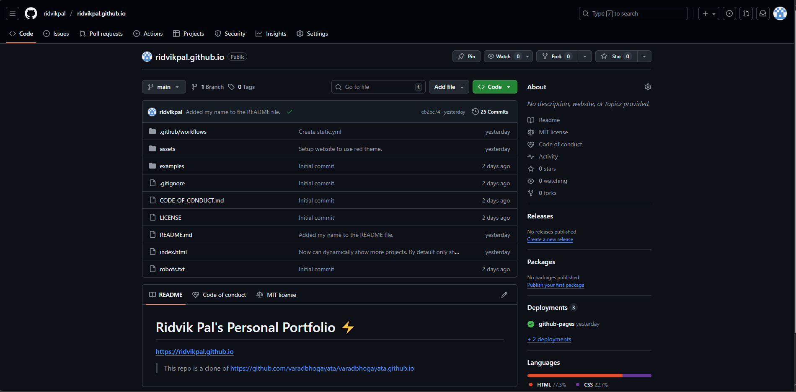

## Activity 2

Screenshot of repo:

Screenshots of personal information added:

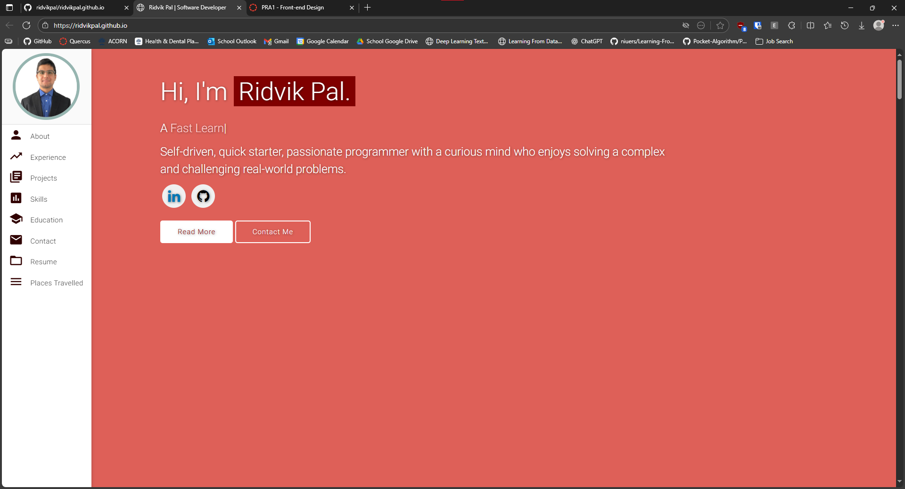

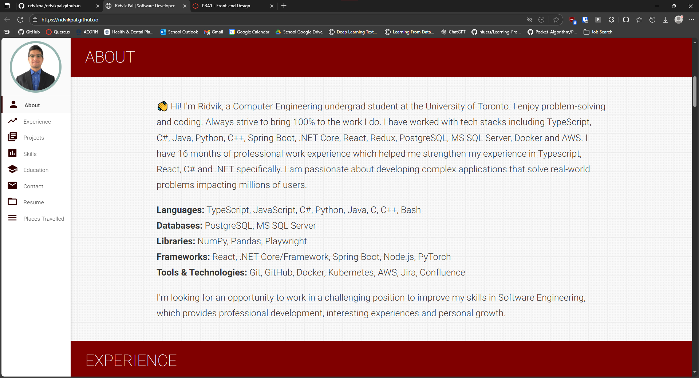

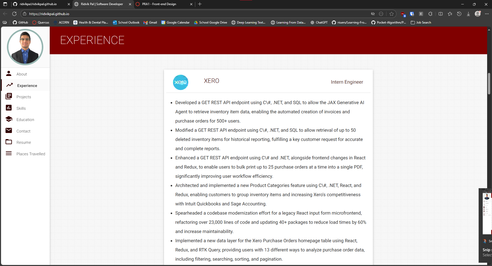

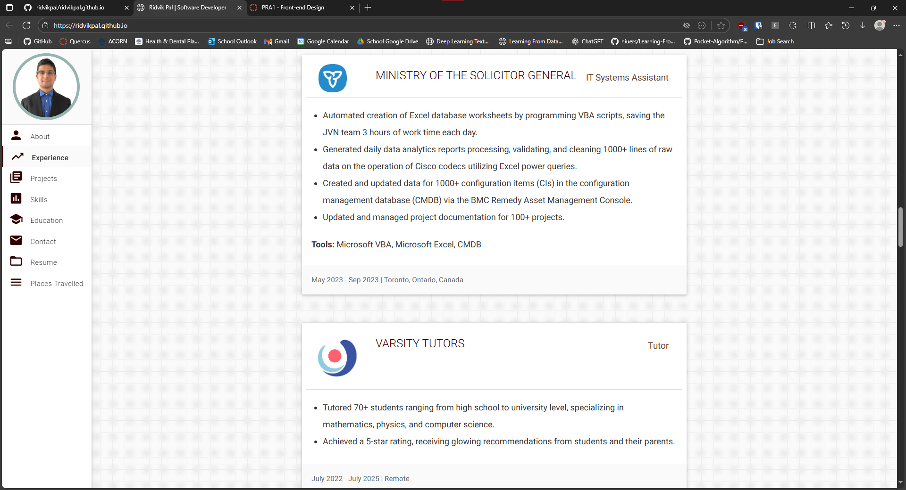

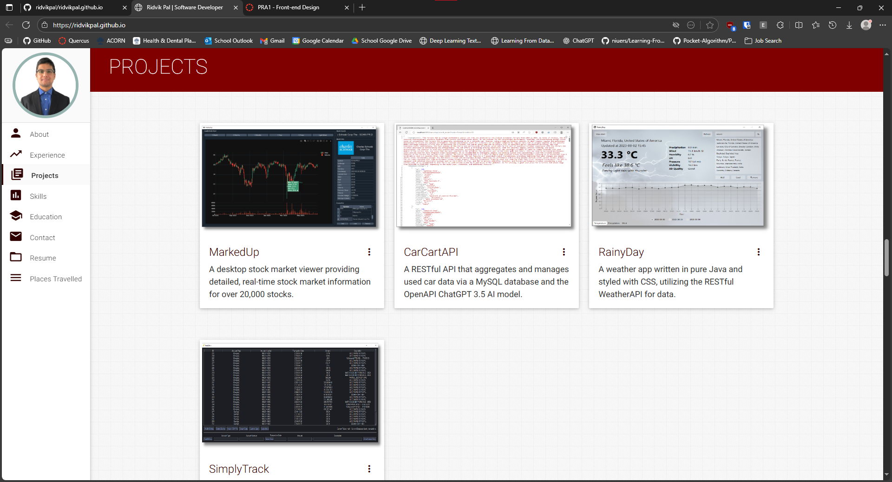

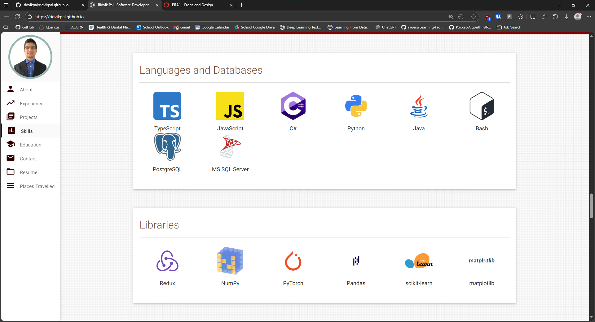

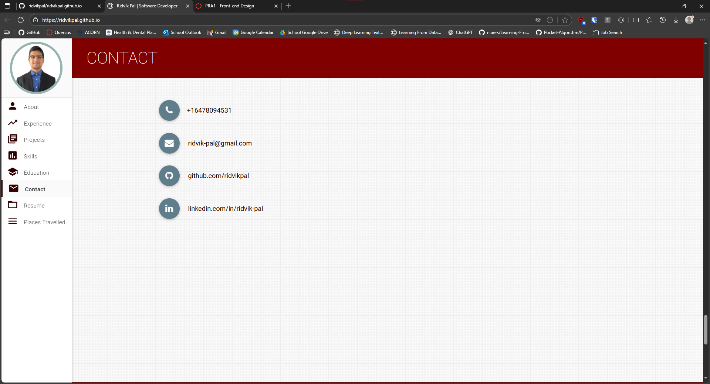

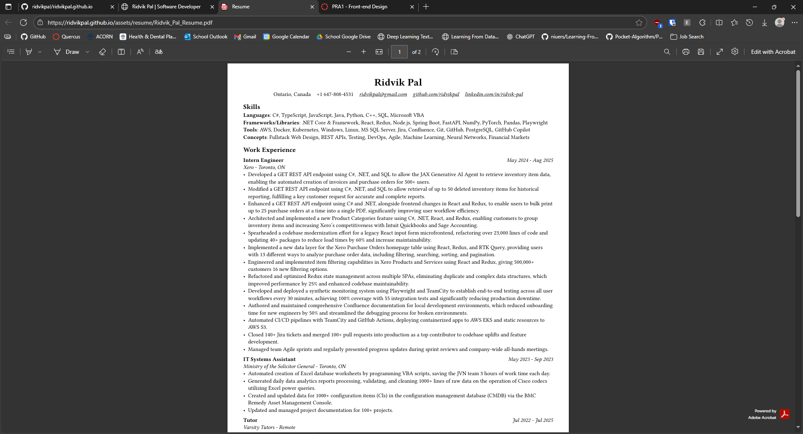

## Activity 3

Screenshot of repo:

Screenshots of color theme changed to red:

## Activity 4

Screenshot of repo:

Screenshot of google maps embedded into the website:

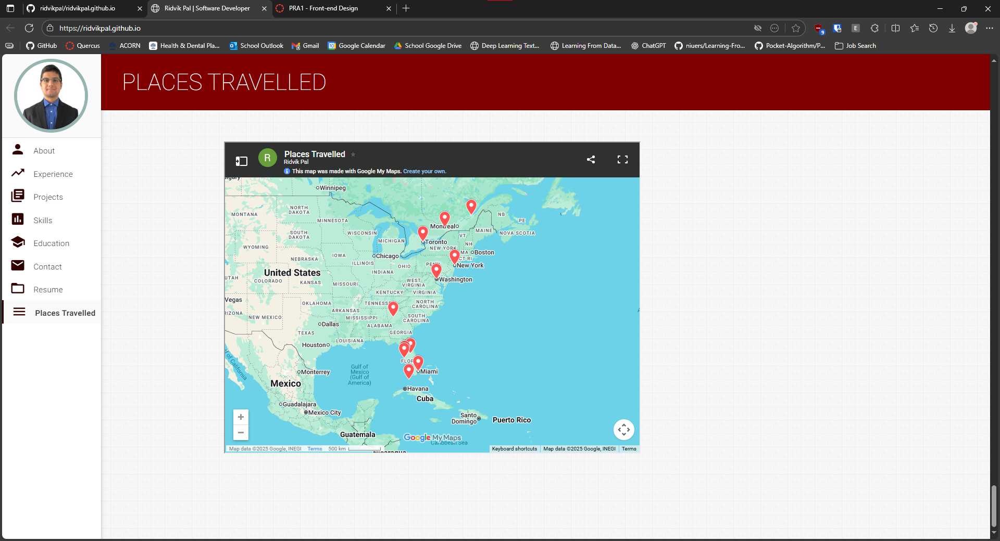

## Activity 5

Screenshot of repo:

Screenshot of Load More button:

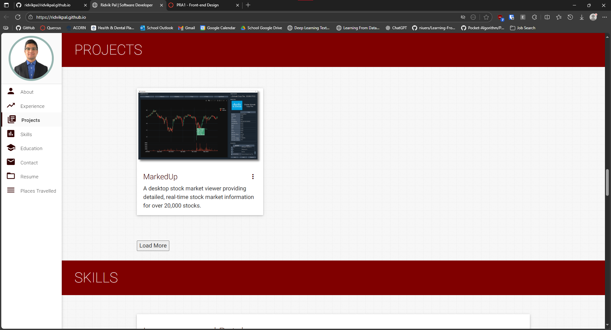

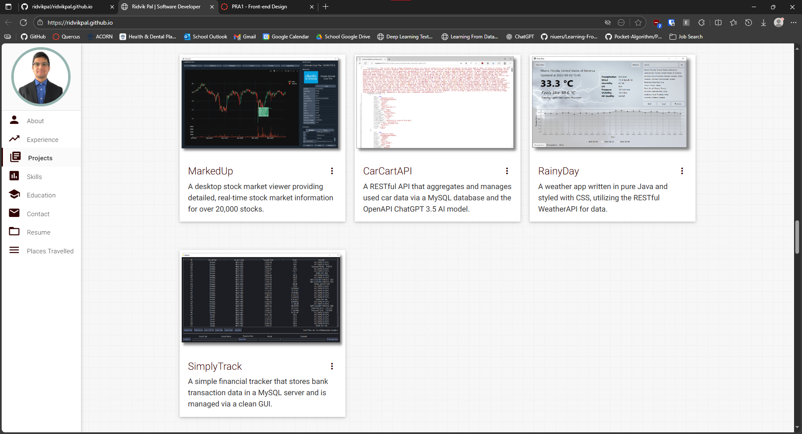
